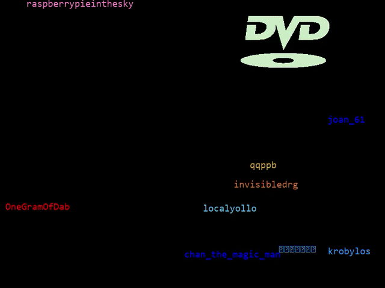

# BRBBot

## Installtion & Setup
Application was built and tested using python 3.12.

### Windows
1. [Install Python](https://www.geeksforgeeks.org/how-to-install-python-on-windows/)
2. [Install pip](https://www.geeksforgeeks.org/how-to-install-pip-on-windows/)
3. From the root directory execute: `pip install -r requirements.txt` using powershell
4. Add twitch-dev application credentials to 

### Setup Configuration File
- Add twitch-dev api key and secret to the appropiate fields of config.yaml
    + Register a twitch-dev account: https://dev.twitch.tv/
    + From "Your Console" register an application
    + Generate a secret from you application
- Add a stream channel name you feel comftorable typing commands in to the channels section

### Load Assets Directory
Look in the assets section of config.yaml for required paths and their meanings.

### Verify Succesful Installtion
From the /src directory execute: `python brbbot.py`

      (_)         | |       (_)                 
       _ _   _ ___| |_       _  __ _ _ __   ___ 
      | | | | / __| __|     | |/ _` | '_ \ / _ \
      | | |_| \__ \ |_      | | (_| | | | |  __/
      | |\__,_|___/\__|     | |\__,_|_| |_|\___|
     _/ |           ______ _/ |                 
    |__/           |______|__/
